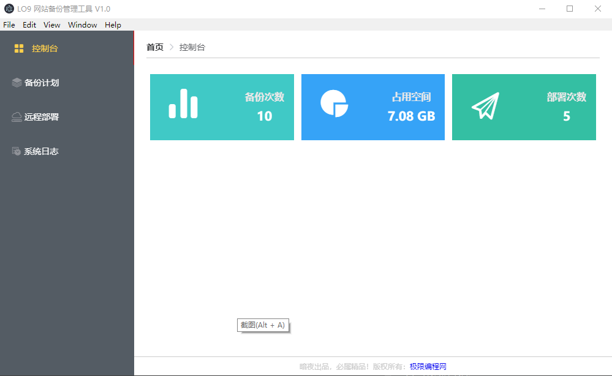
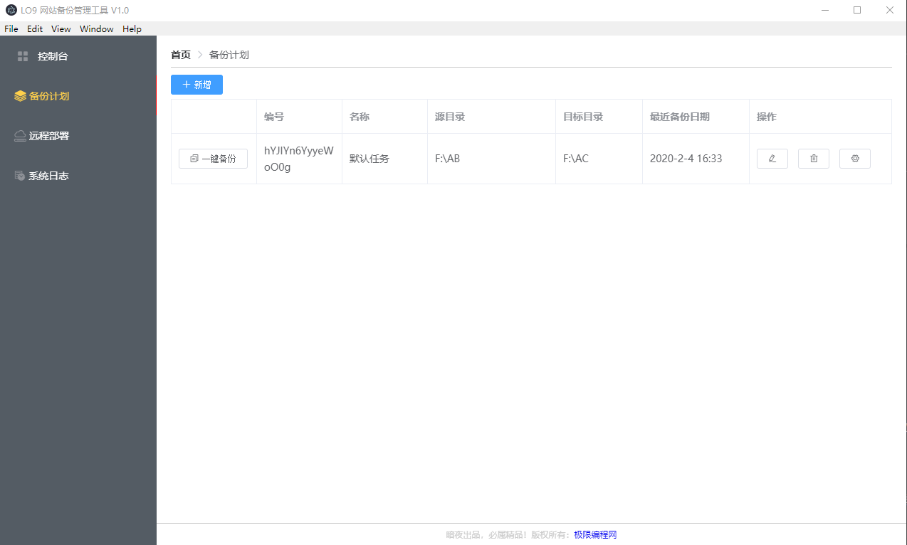
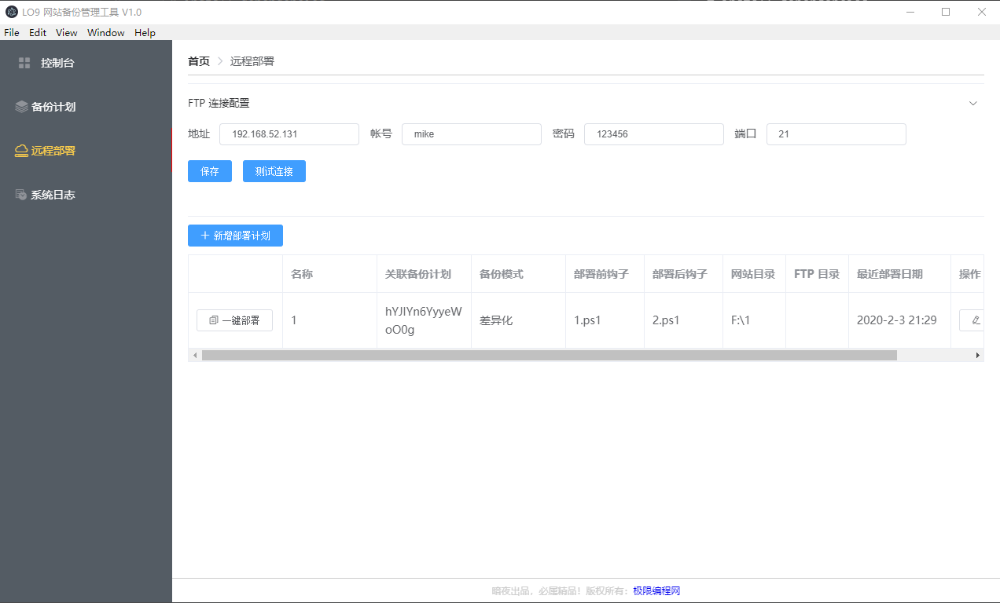

# 网站备份管理工具

> 一个可以用来管理备份、还原备份、远程部署 IIS 应用的工具

#### Build Setup

``` bash
# install dependencies
npm install

# serve with hot reload at localhost:9080
npm run dev

# build electron application for production
npm run build


# lint all JS/Vue component files in `src/`
npm run lint

```

---

#### 功能介绍

1、控制台

可统计备份次数、备份文件大小、部署次数

2、备份计划

可对文件夹进行备份、管理备份记录、备份文件还原

3、远程部署

支持从FTP服务器下载部署文件更新IIS的站点

4、系统日志

支持在线查询、分析工具运行中各种埋点日志

#### 运行截图








This project was generated with [electron-vue](https://github.com/SimulatedGREG/electron-vue) using [vue-cli](https://github.com/vuejs/vue-cli). Documentation about the original structure can be found [here](https://simulatedgreg.gitbooks.io/electron-vue/content/index.html).
